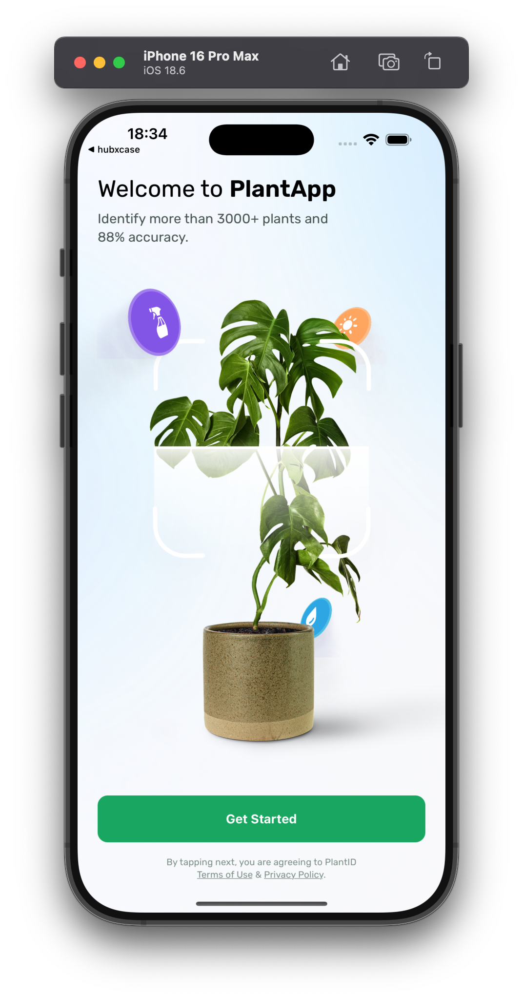
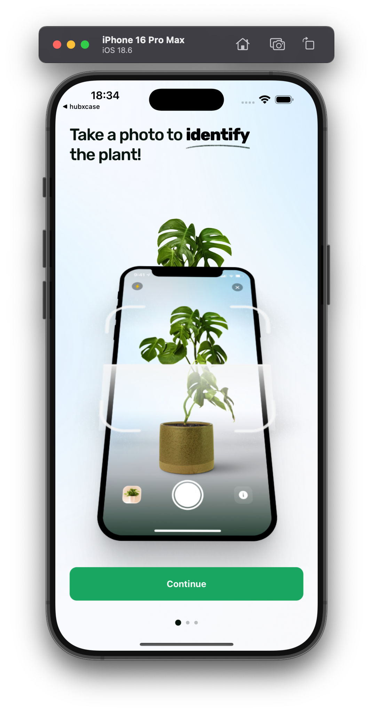
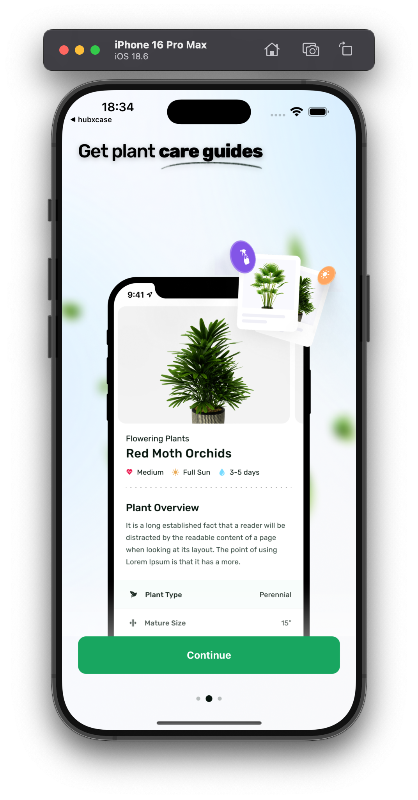
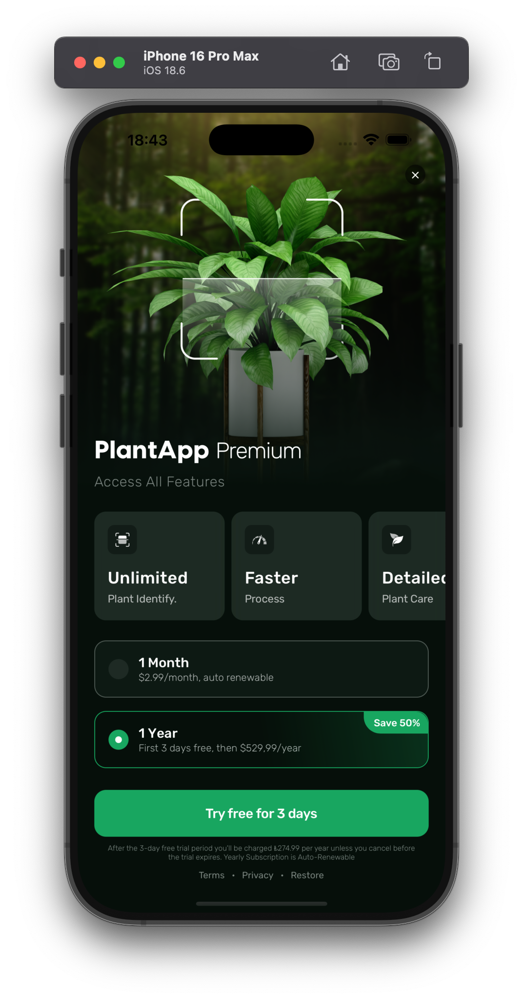
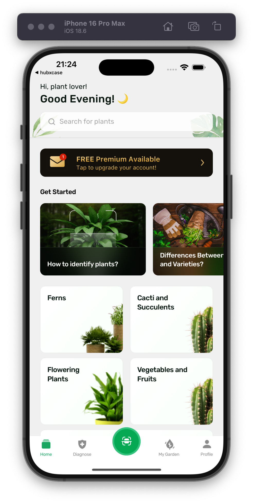

# HubX Case

A React Native assignment - a mobile app with several screens.


## Quick Start

### Installation

1. **Clone the repository**
   ```bash
   git clone <repository-url>
   cd hubx-case
   ```

2. **Install dependencies**
   ```bash
   npm install
   ```

3. **Set up environment variables**
   ```bash
   cp env.example .env
   # Edit .env with your API configuration
   ```

4. **Start the development server**
   ```bash
   npm start
   ```

5. **Run on specific platforms**
   ```bash
   # iOS
   npm run ios
   
   # Android
   npm run android
   ```

### Environment Configuration
Create a `.env` file in the root directory:
```env
EXPO_PUBLIC_API_URL=https://your-api-endpoint.com
```

## Dependencies

### Core Dependencies
- **React Native**: - Mobile app framework
- **Expo**: - Development and build platform
- **TypeScript**: - Type safety
- **Redux Toolkit**: - State management
- **Expo Router**: - File-based navigation

### UI & Animation
- **React Native Reanimated**: - Animations
- **React Native Gesture Handler**: - Touch handling
- **Expo Image**: - Optimized images
- **React Native SVG**: - SVG support

### Development Tools
- **Biome**: - Linting and formatting
- **Jest**: - Testing
- **React Native Testing Library**: - Component testing

## Screenshots

<div align="center">
  <div>
    
    
    
  </div>
  <div>
    
    
  </div>
</div>

## Contact

For questions, please contact:

**Developer**: developer@ozgorkem.com  
**LinkedIn**: linkedin.com/in/görkemözkan

